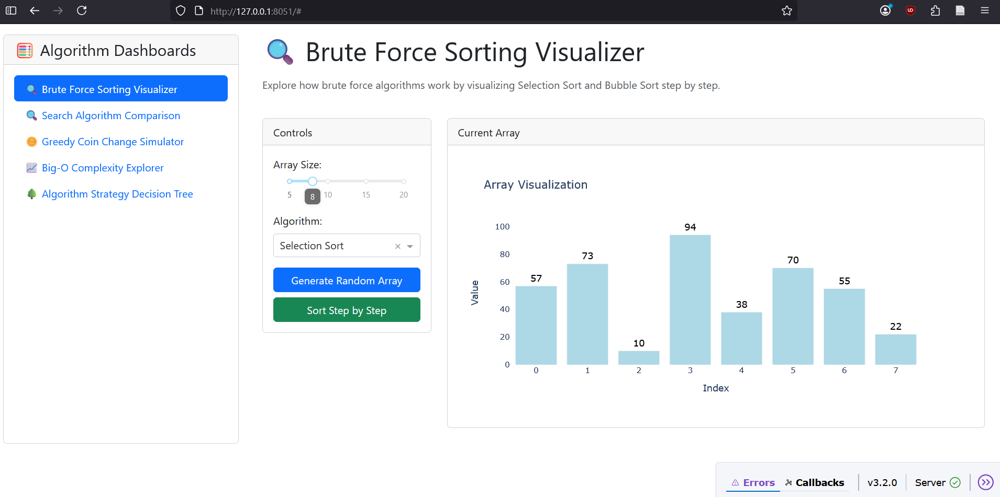

# This is the README file for lab 1.  

## Things I Learned  
* I learned syntax pertaining to markdown files.
* I learned howto create pull requests from a CLI.

### Things I am confused about
1. I need to get better at keeping trach of my branches and how to merge it with the master.
2. I am still confused about forking but I am sure it will become clear the more I practice.

